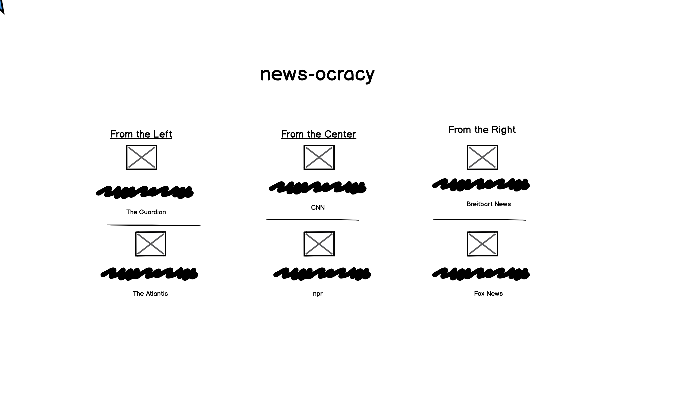
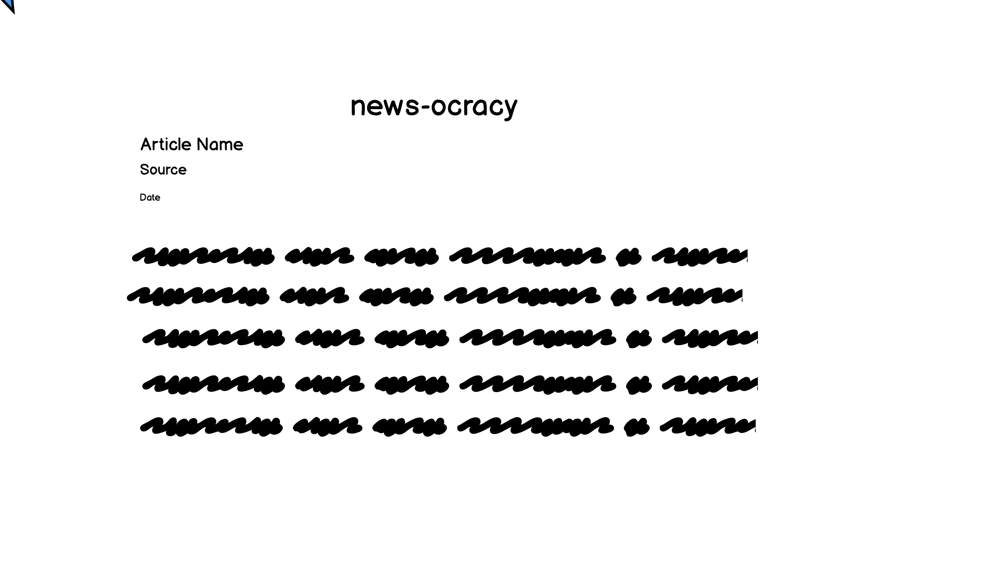
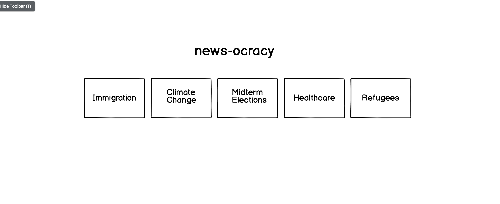

# news-ocracy
The requirements for this project were to use the News API (https://newsapi.org/) and target it towards high school teachers as end users.  With biased news so prevalent right now, I wanted to gear this project toward civics and journalism high school classes so that students can view controversial topics and see news trending for that topic from left, center, and right media sources.  

It was made using The News API, React, and Redux.

## Set Up

Clone down this repo.

Run `npm install` from the root directory.

Run `npm start` and visit localhost:3000 in your browser.

Run tests with `npm test`.

## Final Result

### Screenshots

### Wireframes

